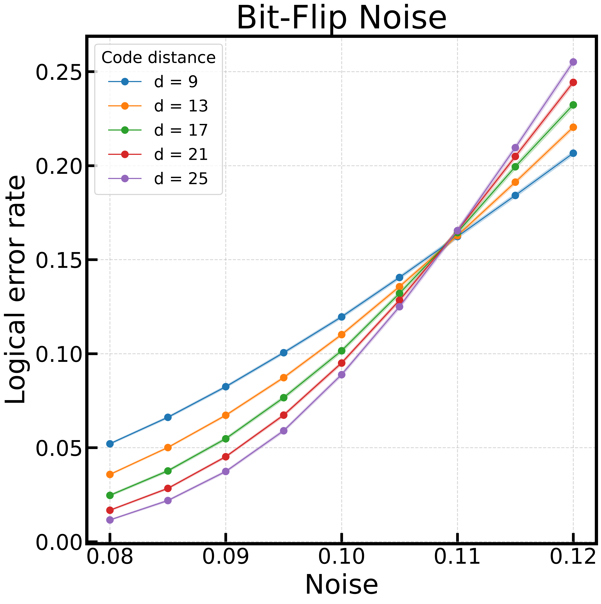
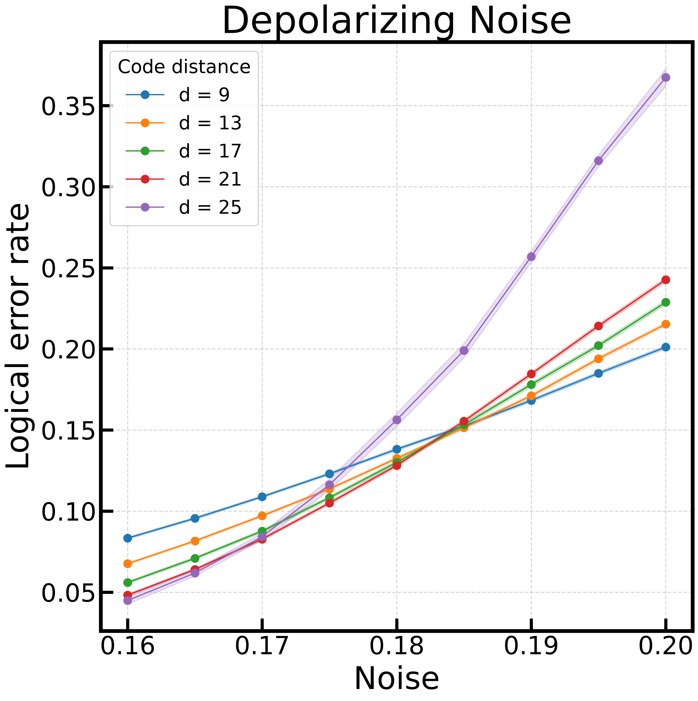

# Tensor Network (BSV) Decoder

A python implementation of the tensor network decoder desrcibed in [this paper](https://arxiv.org/pdf/1405.4883), called the Bravyi-Suchara-Vargo(BSV) decoder.

In this project, we consider a unrotated surface code, running a memory-z experiment. This means that the surface code is initialized in the logical 0 state, i.e., $\ket{0}_L$, and then stored. A logical error then amounts to pauli-errors on the surface code that induce a logical bit-flip : $\ket{0}_L\to\ket{1}_L$. We further specialize to the case of a code-capacity noise model, which means that while the physical data qubits can experience noise, the measurement ancillas are perfect and experience no noise. Furthermore, we only consider the bit-flip and depolarizing noise models.

Under a bit-flip noise model, a pauli-X error occurs with probability $p$, which means that the probability of no error is $1-p$. On the other hand, in a depolarizing noise model, all pauli-errors (X,Y,Z) are equally likely, and occur woth probability $p/3$.

This project uses the ```Stim``` library to generate the surface code circuit. However, we do not use ```stim.Circuit.generated(...)```, as I found that to create a code-capacity model, it was easier to build the circuit from scratch. The circuit is then sampled and decoding events are passed to the decoder, which the predicts if there has been a logical bit-flip.
## Installation
1. Clone the repository:
   ```bash
   git clone git@github.com:sou-27/Tensor-Network-Decoder.git
   cd "TN Decoder"

2. Create a virtual environment and install the package in editable mode:
   ```bash
   python -m venv venv
   source venv/bin/activate  # On Windows: venv\Scripts\activate
   pip install -e .

## Usage

One may run the following script:

```bash
python run_scripts/decoder.py r d noise_model noise chi nfail
```
__Arguments__

1. d(int) : Code distance
2. noise_model(str) : "bit-flip" or "depolarize"
3. noise(float) : Probability to be used in the noise model.
4. chi(int) : Maximum bond dimension to be kept during the tensor network operations.
5. nfail(int) : Minimum of failures the decoder should reach before stopping. Used to calculatye the error rate. 

__Optional arguments__
1. --output_dir : directory to save outputs. default = "results"

_Alternately_, one may also call the function 
```python
from run_scripts.decoder import run_shots
nfails = run_shots(d, noise_model, noise, chi, shots, rng)
```
where,
1. shots(int): Number of shots to be decoded.
2. rng (np.rng)(optional) : rng object used for reproducibility.

Returns:
nfails (int) : Number of failed predictions from our decoder.

You may look through [Run_decoder](Run_scripts/run_decoder.ipynb) to see this in action.

## Threshold analysis
We run this decoder for the bit-flip and depolarizing noise-models for a range of code distances and error rates to determine the threshold. The script [run_sweep_parallel](run_sweep_parallel.py) was submitted to a SLURM job scheduler on a cluster to compute over different code distances and noise models in parallel.

__Bit-flip noise model__


The calculated threshold is between $10.5$% and $11$%. In fact, it appears to be very close to $11$%, which is in excellent agreement with the MLD result of $10.9$%.

__Depolarizing noise model__


The calculated threshold here appears to be between $17$% and $18.5$%, in agreement with the observations of Bravyi et al.


